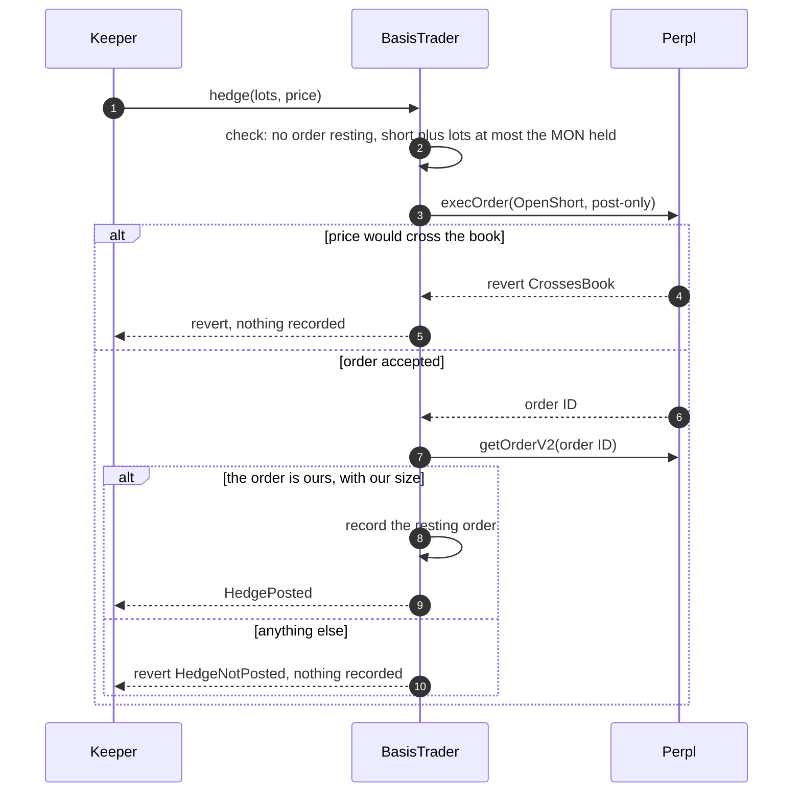
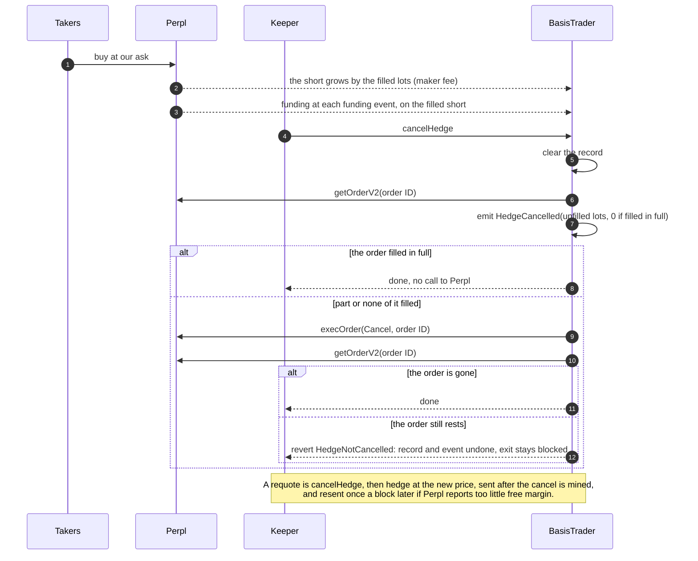
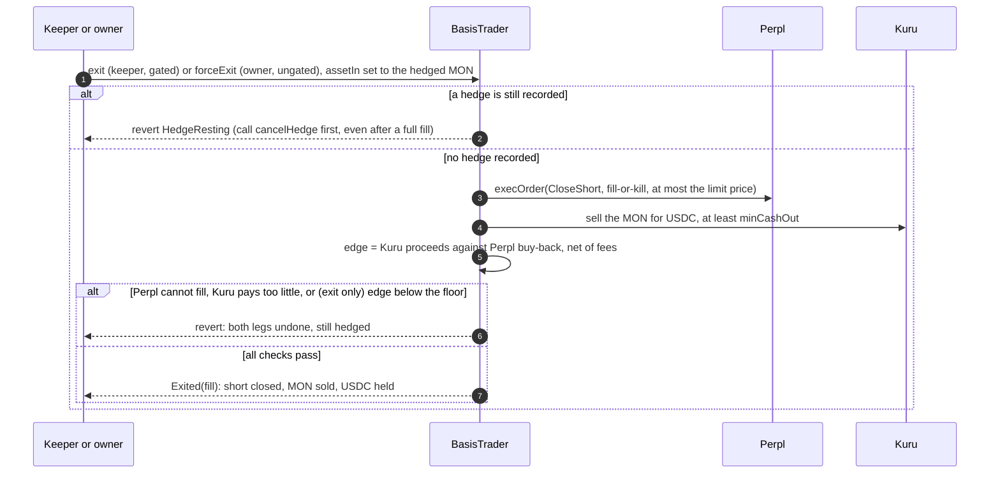

# Hedge in place, sell atomically: flows

A MON holder hedges in place through a contract they own, as a maker on Perpl, run by a keeper that cannot withdraw their funds.
While it is held, the hedge receives funding when funding is positive for shorts, as it was on 26 of 31 days to 6 October on MON, and pays it otherwise.
When the Kuru and Perpl prices allow, the keeper closes the hedge and sells the MON in one atomic transaction, as Perpl's reference contract does.
The hedge is not atomic: it rests on Perpl's book until takers fill it.
The exit is atomic: both legs happen, or neither does.
The contract is our fork of Perpl's reference `BasisTrader`, with `hedge`, `cancelHedge` and a guard on the exit added.

Parties: the owner, who is the holder (deploys, funds, can force an exit, can withdraw); the keeper (posts and cancels the hedge, tops up margin, runs the gated exit, and can send funds nowhere but the venues it trades with; that its trades cannot hurt the holder rests on the owner's floors and a price bound on the hedge, which are being added and tested); `BasisTrader` (holds the MON and the Perpl account); Perpl (the perpetual); Kuru (the spot book).

## States

```mermaid
stateDiagram-v2
    [*] --> Unhedged: owner sends MON to the contract
    Unhedged --> Resting: hedge (post-only short accepted)
    Unhedged --> Unhedged: hedge reverts (price would cross, or short above MON held)
    Resting --> Resting: takers fill part of the short
    Resting --> Hedged: takers fill all of it, then cancelHedge forgets the order
    Resting --> PartlyHedged: cancelHedge removes the unfilled rest
    Resting --> Unhedged: cancelHedge before any fill
    PartlyHedged --> Resting: hedge again for the rest (requote)
    Unhedged --> Resting: hedge again (requote)
    Hedged --> Hedged: hold, earning funding; the keeper tops up margin and checks the exit gate on a cadence
    PartlyHedged --> PartlyHedged: hold, as Hedged, on the filled part
    Hedged --> Closed: exit when the gate opens, or forceExit under margin pressure or at the end (atomic)
    PartlyHedged --> Closed: exit or forceExit with assetIn set to the filled lots
    Resting --> Resting: exit refused while a hedge is recorded
    Hedged --> Hedged: exit reverts (edge below floor, or Kuru pays too little)
    Closed --> [*]: owner sweeps the USDC and any MON left, and withdraws margin
```

Once hedged, the position is held: the short earns funding at each funding event, the keeper keeps its margin and simulates the gated exit on a cadence, and sends it only when the gate opens.
`forceExit` is the owner's tool for margin pressure or the end of the hedge, not a schedule.

While a hedge is recorded, the exit is refused: a resting ask could fill after the MON is sold, which would leave a short with nothing behind it.
The record is cleared only by `cancelHedge`, so it is called before every exit, also after a full fill.
`hedge` refuses a short larger than the MON held, and the exit sells exactly what it closes; the owner must not `sweep` MON while the short is open.

## Hedge: post-only, not atomic

## While the order rests: fills, funding and requotes

## Exit: atomic, all or nothing

A refused exit leaves the position as it was: MON held against the short.
The keeper's `exit` waits for an edge at or above the floor; the owner's `forceExit` closes regardless of the edge, within its price bounds, for margin pressure or the end of the hedge.
If the short is smaller than the MON held (a part fill), `assetIn` must be the filled lots in MON; with `assetIn` 0 the exit tries to close as many lots as the whole MON balance, and Perpl reverts with `CloseOrderExceedsPosition` (tested on a mainnet fork).

## Compared with the reference contract

The reference `BasisTrader` opens a position by buying spot on Kuru and shorting on Perpl in one atomic, gated transaction, with both legs as takers.
That entry pays Kuru's spread and Perpl's taker fee at once, so its gate rarely opens.
Here the holder already owns the spot, so there is no purchase, and the short is posted as a maker; the reference's atomic, gated exit is kept as it is.

## Where this goes

One instance per holder: the holder deploys and owns their own `BasisTrader`, and names our keeper.
The keeper's functions trade and manage margin inside the instance; none of them can send funds anywhere but the venues it trades with, and its trades are bounded by the floors the owner sets, so the holder keeps custody. Adversarial tests of that bound are the next step.

Next, a vault that owns an instance, so that many holders share one instance and hold a transferable share; its simplest honest form takes deposits and withdrawals only between rounds, while no hedge is open or resting.
Two problems stand before it:
- Two assets come in, MON for the spot and AUSD for Perpl margin, and ERC-4626 takes one; wrapping MON helps with the first but not the second, and Kuru's MON/AUSD book was empty when we checked.
- A maker hedge fills over minutes to hours, so a deposit that arrives while the hedge is part filled must be priced against a position that is partly unhedged, valued at the Perpl mark, without moving value between depositors.
